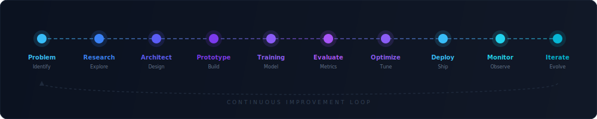

<!-- ╔══════════════════════════════════════════════════════════════════════════╗
     ║  ARYAN MEDIGERI — GitHub Profile README                                ║
     ║  Premium Developer Landing Page                                        ║
     ║                                                                        ║
     ║  ⚙️  SETUP — Do these steps before deploying:                          ║
     ║                                                                        ║
     ║  1. DEPLOY YOUR OWN github-readme-stats:                               ║
     ║     • Fork https://github.com/anuraghazra/github-readme-stats          ║
     ║     • Deploy to Vercel (one-click: Import Git Repository)              ║
     ║     • Add env variable PAT_1 = your GitHub Personal Access Token       ║
     ║       (needs public_repo scope)                                        ║
     ║     • Replace YOUR_GH_STATS_VERCEL below with your Vercel domain       ║
     ║       e.g. github-readme-stats-aryanmedigeri08.vercel.app              ║
     ║                                                                        ║
     ║  2. PUSH this repo as AryanMedigeri08/AryanMedigeri08 on GitHub        ║
     ║     • The snake & profile-summary-cards workflows run automatically    ║
     ║     • Or trigger them manually from the Actions tab                    ║
     ║                                                                        ║
     ║  3. UPDATE social URLs (LinkedIn, Medium, Portfolio, Email)            ║
     ╚══════════════════════════════════════════════════════════════════════════╝ -->

<!-- ━━━━━━━━━━━━━━━━━━━━━━━━━━━━━━━━━━━━━━━━━━━━━━━━━━━━━━━━━━━━━━━━━━━━━━━━
     §1  HERO BANNER
     ━━━━━━━━━━━━━━━━━━━━━━━━━━━━━━━━━━━━━━━━━━━━━━━━━━━━━━━━━━━━━━━━━━━━━━━━ -->

<div align="center">

  

  <br>

  <a href="https://git.io/typing-svg">
    
  </a>

  <br><br>

  <!-- Profile Metrics -->
  
  &nbsp;&nbsp;
  
  &nbsp;&nbsp;
  

  <br><br>

  <!-- Social Buttons -->
  <a href="https://linkedin.com/in/aryanmedigeri">
    
  </a>
  &nbsp;
  <a href="https://medium.com/@aryanmedigeri">
    
  </a>
  &nbsp;
  <a href="mailto:aryanmedigeri08@gmail.com">
    
  </a>
  &nbsp;
  <a href="https://aryanmedigeri.dev">
    
  </a>

</div>

<br>

<div align="center">
  
</div>

<br>

<!-- ━━━━━━━━━━━━━━━━━━━━━━━━━━━━━━━━━━━━━━━━━━━━━━━━━━━━━━━━━━━━━━━━━━━━━━━━
     §2  TERMINAL INTRODUCTION
     ━━━━━━━━━━━━━━━━━━━━━━━━━━━━━━━━━━━━━━━━━━━━━━━━━━━━━━━━━━━━━━━━━━━━━━━━ -->

<h2 align="center">▸ Terminal</h2>
<p align="center"><em>Who I am, the fast way</em></p>

<br>

```python
#!/usr/bin/env python3
# aryan_medigeri.py — About Me

class Developer:
    def __init__(self):
        self.name         = "Aryan Medigeri"
        self.role         = "AI Engineer & Full Stack Developer"
        self.education    = "B.Tech CSE (Data Science)"
        self.building     = ["Sentinel AI — Real-time UPI Fraud Detection",
                             "Elysium — Financial Risk Intelligence Platform"]
        self.interests    = ["Machine Learning", "Computer Vision", "Edge AI",
                             "Cloud Architecture", "Distributed Systems", "MLOps"]
        self.achievements = {"National Datathon": "🏆 Winner — Sentinel AI",
                             "Research":          "📄 Published — OsteoVision",
                             "Hackathon":         "🥈 Finalist — FlowCast AI",
                             "Deployments":       "🚀 6+ Production Systems"}
        self.philosophy   = "Build systems that solve real problems. Ship fast. Iterate faster."

    def __repr__(self):
        return f"<Developer: {self.name} | {self.role}>"

me = Developer()
```

<br>

<div align="center">
  
</div>

<br>

<!-- ━━━━━━━━━━━━━━━━━━━━━━━━━━━━━━━━━━━━━━━━━━━━━━━━━━━━━━━━━━━━━━━━━━━━━━━━
     §3  DEVELOPER SNAPSHOT
     ━━━━━━━━━━━━━━━━━━━━━━━━━━━━━━━━━━━━━━━━━━━━━━━━━━━━━━━━━━━━━━━━━━━━━━━━ -->

<h2 align="center">📋 Developer Snapshot</h2>
<p align="center"><em>At a glance</em></p>

<br>

<div align="center">

| | Detail | | Detail |
|:---|:---|:---|:---|
| 🎓 **Education** | B.Tech CSE (Data Science) | 🔬 **Current Focus** | Production ML Pipelines |
| 📍 **Location** | Pune, India | 🏆 **Hackathons** | National Winner + Finalist |
| 💼 **Experience** | AI/ML & Full Stack Development | 📄 **Research** | Published — Medical AI |
| 🎯 **Specialization** | Real-time ML Systems | 🚀 **Deployments** | 6+ Production Systems |
| ⚡ **Edge AI** | IoT & Embedded Inference | 🧠 **Tech Domains** | AI · Vision · Cloud · Edge · Full Stack |

</div>

<br>

<div align="center">
  
</div>

<br>

<!-- ━━━━━━━━━━━━━━━━━━━━━━━━━━━━━━━━━━━━━━━━━━━━━━━━━━━━━━━━━━━━━━━━━━━━━━━━
     §4  FEATURED PROJECTS
     ━━━━━━━━━━━━━━━━━━━━━━━━━━━━━━━━━━━━━━━━━━━━━━━━━━━━━━━━━━━━━━━━━━━━━━━━ -->

<h2 align="center">🚀 Featured Projects</h2>
<p align="center"><em>Systems I've built from zero to production</em></p>

<br>

<!-- ROW 1 ─────────────────────────────────────────────────────── -->

<table>
<tr>

<!-- ── SENTINEL AI ── -->
<td width="50%" valign="top">

<h3 align="center">🛡️ Sentinel AI</h3>

<div align="center">
  
  
</div>

<br>

<div align="center">
  <strong>Real-time UPI Fraud Detection System</strong>
</div>

<br>

<blockquote>Multi-model ML pipeline detecting fraudulent UPI transactions in real-time using graph neural networks, behavioral analysis, and ensemble learning.</blockquote>

<p>
&nbsp;&nbsp;🔹 Real-time event streaming with <strong>Apache Kafka</strong><br>
&nbsp;&nbsp;🔹 Graph-based fraud pattern detection via <strong>Neo4j</strong><br>
&nbsp;&nbsp;🔹 Ensemble ML: <strong>XGBoost + Isolation Forest + LSTM</strong><br>
&nbsp;&nbsp;🔹 Sub-second inference with <strong>Redis</strong> caching layer
</p>

<div align="center">
  <code>FastAPI</code>&nbsp;<code>Kafka</code>&nbsp;<code>Neo4j</code>&nbsp;<code>Redis</code>&nbsp;<code>XGBoost</code>&nbsp;<code>LSTM</code>
  <br><br>
  <a href="https://github.com/AryanMedigeri08/Sentinel.AI">
    
  </a>
</div>

<br>

</td>

<!-- ── ELYSIUM ── -->
<td width="50%" valign="top">

<h3 align="center">💎 Elysium</h3>

<div align="center">
  
  
</div>

<br>

<div align="center">
  <strong>Financial Risk Intelligence Platform</strong>
</div>

<br>

<blockquote>GPU-accelerated financial risk analysis platform leveraging RAPIDS, Gemini AI, and BigQuery vector search for real-time risk assessment and intelligence.</blockquote>

<p>
&nbsp;&nbsp;🔹 GPU-accelerated analytics with <strong>NVIDIA RAPIDS</strong><br>
&nbsp;&nbsp;🔹 RAG-powered risk intelligence via <strong>Gemini</strong><br>
&nbsp;&nbsp;🔹 Semantic search with <strong>BigQuery Vector Search</strong><br>
&nbsp;&nbsp;🔹 Serverless deployment on <strong>Cloud Run</strong>
</p>

<div align="center">
  <code>RAPIDS</code>&nbsp;<code>Gemini</code>&nbsp;<code>BigQuery</code>&nbsp;<code>Cloud Run</code>&nbsp;<code>RAG</code>
  <br><br>
  <a href="https://github.com/AryanMedigeri08/Elysium">
    
  </a>
</div>

<br>

</td>

</tr>
</table>

<!-- ROW 2 ─────────────────────────────────────────────────────── -->

<table>
<tr>

<!-- ── OSTEOVISION ── -->
<td width="50%" valign="top">

<h3 align="center">🔬 OsteoVision</h3>

<div align="center">
  
  
</div>

<br>

<div align="center">
  <strong>AI-Powered Knee Osteoarthritis Detection</strong>
</div>

<br>

<blockquote>Deep learning system for automated knee osteoarthritis grading with explainable AI visualizations, enabling clinical decision support.</blockquote>

<p>
&nbsp;&nbsp;🔹 <strong>CNN</strong>-based severity classification pipeline<br>
&nbsp;&nbsp;🔹 <strong>GradCAM</strong> explainability heatmaps for clinicians<br>
&nbsp;&nbsp;🔹 <strong>OpenCV</strong> medical image preprocessing pipeline<br>
&nbsp;&nbsp;🔹 <strong>React</strong>-based interactive clinical dashboard
</p>

<div align="center">
  <code>CNN</code>&nbsp;<code>GradCAM</code>&nbsp;<code>OpenCV</code>&nbsp;<code>React</code>&nbsp;<code>TensorFlow</code>
  <br><br>
  <a href="https://github.com/AryanMedigeri08/OsteoVision">
    
  </a>
</div>

<br>

</td>

<!-- ── PCMFMS ── -->
<td width="50%" valign="top">

<h3 align="center">⚡ PCMFMS</h3>

<div align="center">
  
  
</div>

<br>

<div align="center">
  <strong>Real-time Cognitive Motor Fatigue Detection</strong>
</div>

<br>

<blockquote>Edge AI system for real-time fatigue monitoring using facial landmark stability analysis, deployed on ESP32 microcontrollers with WebSocket streaming.</blockquote>

<p>
&nbsp;&nbsp;🔹 <strong>MediaPipe</strong> facial landmark detection<br>
&nbsp;&nbsp;🔹 Optimized edge inference with <strong>ONNX Runtime</strong><br>
&nbsp;&nbsp;🔹 <strong>ESP32</strong> IoT hardware integration<br>
&nbsp;&nbsp;🔹 <strong>WebSocket</strong> real-time data streaming
</p>

<div align="center">
  <code>MediaPipe</code>&nbsp;<code>ONNX</code>&nbsp;<code>ESP32</code>&nbsp;<code>WebSockets</code>&nbsp;<code>Edge AI</code>
  <br><br>
  <a href="https://github.com/AryanMedigeri08/Predictive-Cognitive-Motor-Fatigue-Monitoring-System-Using-Facial-Landmark-Stability">
    
  </a>
</div>

<br>

</td>

</tr>
</table>

<!-- ROW 3 ─────────────────────────────────────────────────────── -->

<table>
<tr>

<!-- ── FLOWCAST AI ── -->
<td width="50%" valign="top">

<h3 align="center">📊 FlowCast AI</h3>

<div align="center">
  
  
</div>

<br>

<div align="center">
  <strong>Retail Demand Forecasting Platform</strong>
</div>

<br>

<blockquote>Intelligent demand forecasting system for retail with interactive dashboards, predictive analytics, and multi-variable time-series modeling.</blockquote>

<p>
&nbsp;&nbsp;🔹 ML-powered <strong>demand prediction</strong> engine<br>
&nbsp;&nbsp;🔹 Interactive <strong>Recharts</strong> data visualizations<br>
&nbsp;&nbsp;🔹 <strong>React</strong> dashboard with real-time updates<br>
&nbsp;&nbsp;🔹 Multi-variable <strong>time-series forecasting</strong> models
</p>

<div align="center">
  <code>React</code>&nbsp;<code>Python</code>&nbsp;<code>Recharts</code>&nbsp;<code>Scikit-learn</code>
  <br><br>
  <a href="https://github.com/AryanMedigeri08/flowcast-ai-design">
    
  </a>
</div>

<br>

</td>

<!-- ── AABHA ── -->
<td width="50%" valign="top">

<h3 align="center">🌟 Aabha</h3>

<div align="center">
  
  
</div>

<br>

<div align="center">
  <strong>AI-Powered Accessibility Platform</strong>
</div>

<br>

<blockquote>Comprehensive AI accessibility platform combining vision transformers, speech synthesis, OCR, and image captioning for inclusive technology access.</blockquote>

<p>
&nbsp;&nbsp;🔹 <strong>BLIP</strong> image captioning for visual descriptions<br>
&nbsp;&nbsp;🔹 <strong>Vision Transformer</strong> scene analysis<br>
&nbsp;&nbsp;🔹 <strong>Gemini</strong> multimodal AI integration<br>
&nbsp;&nbsp;🔹 <strong>Speech synthesis</strong> and <strong>OCR</strong> pipelines
</p>

<div align="center">
  <code>BLIP</code>&nbsp;<code>ViT</code>&nbsp;<code>Gemini</code>&nbsp;<code>Speech</code>&nbsp;<code>OCR</code>
  <br><br>
  <a href="https://github.com/AryanMedigeri08/Aabha">
    
  </a>
</div>

<br>

</td>

</tr>
</table>

<br>

<div align="center">
  
</div>

<br>

<!-- ━━━━━━━━━━━━━━━━━━━━━━━━━━━━━━━━━━━━━━━━━━━━━━━━━━━━━━━━━━━━━━━━━━━━━━━━
     §5  CURRENT FOCUS
     ━━━━━━━━━━━━━━━━━━━━━━━━━━━━━━━━━━━━━━━━━━━━━━━━━━━━━━━━━━━━━━━━━━━━━━━━ 

<h2 align="center">🎯 Current Focus</h2>
<p align="center"><em>What I'm working on right now</em></p>

<br>

<table>
<tr>

<td align="center" width="50%" valign="top">

**🔨 Building**

<br>

`Sentinel AI v2` — Next-gen fraud detection pipeline
<br>
`Elysium Platform` — Financial risk intelligence at scale

<br>

</td>

<td align="center" width="50%" valign="top">

**📚 Learning**

<br>

`Advanced MLOps` · `Distributed Training`
<br>
`System Design` · `Kubernetes Orchestration`

<br>

</td>

</tr>
<tr>

<td align="center" width="50%" valign="top">

**🔬 Researching**

<br>

`Graph Neural Networks` · `Explainable AI`
<br>
`Edge Inference` · `Federated Learning`

<br>

</td>

<td align="center" width="50%" valign="top">

**🎯 Upcoming**

<br>

`Open Source Contributions` · `Technical Blog`
<br>
`Conference Talks` · `Community Building`

<br>

</td>

</tr>
</table>

<br>

<div align="center">
  
</div>

<br>-->

<!-- ━━━━━━━━━━━━━━━━━━━━━━━━━━━━━━━━━━━━━━━━━━━━━━━━━━━━━━━━━━━━━━━━━━━━━━━━
     §6  DEVELOPMENT PHILOSOPHY
     ━━━━━━━━━━━━━━━━━━━━━━━━━━━━━━━━━━━━━━━━━━━━━━━━━━━━━━━━━━━━━━━━━━━━━━━━ -->

<h2 align="center">⚙️ Development Philosophy</h2>
<p align="center"><em>From problem to production — the engineering mindset</em></p>

<br>

<div align="center">
  
</div>

<br>

<div align="center">

  
  &nbsp;➜&nbsp;
  
  &nbsp;➜&nbsp;
  
  &nbsp;➜&nbsp;
  
  &nbsp;➜&nbsp;
  

  <br><br>

  
  &nbsp;➜&nbsp;
  
  &nbsp;➜&nbsp;
  
  &nbsp;➜&nbsp;
  
  &nbsp;➜&nbsp;
  

</div>

<br>

<div align="center">
  
</div>

<br>

<!-- ━━━━━━━━━━━━━━━━━━━━━━━━━━━━━━━━━━━━━━━━━━━━━━━━━━━━━━━━━━━━━━━━━━━━━━━━
     §7  TECH ARSENAL
     ━━━━━━━━━━━━━━━━━━━━━━━━━━━━━━━━━━━━━━━━━━━━━━━━━━━━━━━━━━━━━━━━━━━━━━━━ -->

<h2 align="center">🧰 Tech Arsenal</h2>
<p align="center"><em>Technologies I build with</em></p>

<br>

<div align="center">

<table>
<tr>
<td align="center" width="140"><strong>Languages</strong></td>
<td align="center">


</td>
</tr>
<tr>
<td align="center"><strong>Frontend</strong></td>
<td align="center">


</td>
</tr>
<tr>
<td align="center"><strong>Backend</strong></td>
<td align="center">


</td>
</tr>
<tr>
<td align="center"><strong>AI / ML</strong></td>
<td align="center">


&nbsp;&nbsp;


</td>
</tr>
<tr>
<td align="center"><strong>Cloud</strong></td>
<td align="center">


</td>
</tr>
<tr>
<td align="center"><strong>Database</strong></td>
<td align="center">


&nbsp;&nbsp;


</td>
</tr>
<tr>
<td align="center"><strong>DevOps</strong></td>
<td align="center">


</td>
</tr>
<tr>
<td align="center"><strong>Hardware</strong></td>
<td align="center">


&nbsp;&nbsp;


</td>
</tr>
</table>

</div>

<br>

<div align="center">
  
</div>

<br>

<!-- ━━━━━━━━━━━━━━━━━━━━━━━━━━━━━━━━━━━━━━━━━━━━━━━━━━━━━━━━━━━━━━━━━━━━━━━━
     §8  ACHIEVEMENTS
     ━━━━━━━━━━━━━━━━━━━━━━━━━━━━━━━━━━━━━━━━━━━━━━━━━━━━━━━━━━━━━━━━━━━━━━━━ -->

<h2 align="center">🏆 Achievements</h2>
<p align="center"><em>Milestones that define the journey</em></p>

<br>

<div align="center">

  
  &nbsp;&nbsp;
  
  &nbsp;&nbsp;
  

</div>

<br>

<table>
<tr>

<td align="center" width="33%" valign="top">

<br>


<br><br>

**National Datathon Winner**

Sentinel AI — Real-time UPI Fraud Detection system recognized at the national level.

<br>

</td>

<td align="center" width="33%" valign="top">

<br>


<br><br>

**Research Publication**

OsteoVision — Published research on AI-powered knee osteoarthritis detection with GradCAM explainability.

<br>

</td>

<td align="center" width="33%" valign="top">

<br>


<br><br>

**Hackathon Finalist**

FlowCast AI — Retail demand forecasting platform selected as a finalist at a competitive hackathon.

<br>

</td>

</tr>
</table>

<br>

<div align="center">

  
  &nbsp;&nbsp;
  
  &nbsp;&nbsp;
  

</div>

<br>

<div align="center">
  
</div>

<br>

<!-- ━━━━━━━━━━━━━━━━━━━━━━━━━━━━━━━━━━━━━━━━━━━━━━━━━━━━━━━━━━━━━━━━━━━━━━━━
     §9  GITHUB ANALYTICS
     ━━━━━━━━━━━━━━━━━━━━━━━━━━━━━━━━━━━━━━━━━━━━━━━━━━━━━━━━━━━━━━━━━━━━━━━━ -->

<h2 align="center">📈 GitHub Analytics</h2>
<p align="center"><em>Contribution activity and statistics</em></p>

<br>

<!-- Stats + Languages side by side
     ⚠️  Replace YOUR_GH_STATS_VERCEL with your self-deployed Vercel domain.
     See setup instructions at the top of this file. -->
<div align="center">
  
  &nbsp;
  
</div>

<br>

<!-- Streak -->
<div align="center">
  
</div>

<br>

<!-- Activity Graph -->
<div align="center">
  
</div>

<br>

<!-- Profile Summary Cards — Generated by GitHub Action (.github/workflows/profile-summary-cards.yml)
     These images are auto-committed to the profile-summary-card-output branch. -->
<div align="center">
  
</div>

<br>

<div align="center">
  
  &nbsp;
  
</div>

<br>

<!-- Contribution Snake -->
<div align="center">
  <picture>
    <source media="(prefers-color-scheme: dark)" srcset="https://raw.githubusercontent.com/AryanMedigeri08/AryanMedigeri08/output/github-contribution-grid-snake-dark.svg" />
    <source media="(prefers-color-scheme: light)" srcset="https://raw.githubusercontent.com/AryanMedigeri08/AryanMedigeri08/output/github-contribution-grid-snake.svg" />
    
  </picture>
</div>

<!-- NOTE: The snake animation requires the GitHub Action in .github/workflows/snake.yml
     Push this repo to GitHub and the action will generate the snake SVG automatically. -->

<br>

<div align="center">
  
</div>

<br>

<!-- ━━━━━━━━━━━━━━━━━━━━━━━━━━━━━━━━━━━━━━━━━━━━━━━━━━━━━━━━━━━━━━━━━━━━━━━━
     §10  OPEN SOURCE & COMMUNITY
     ━━━━━━━━━━━━━━━━━━━━━━━━━━━━━━━━━━━━━━━━━━━━━━━━━━━━━━━━━━━━━━━━━━━━━━━━ -->

<h2 align="center">🌍 Open Source & Community</h2>
<p align="center"><em>Building in the open</em></p>

<br>

<table>
<tr>

<td width="50%" valign="top">

### Current Contributions

- 🔨 Actively maintaining **6 production repositories**
- 🌱 Contributing to open source **ML & AI** projects
- 📖 Sharing knowledge through **technical writing** on Medium
- 🤝 Open to collaboration on **AI/ML** and **full stack** projects

</td>

<td width="50%" valign="top">

### Interesting Facts

- 🌙 Most productive after midnight — a true **nocturnal coder**
- ☕ Powered by **caffeine** and an unhealthy amount of curiosity
- 🧪 I prototype with pen & paper before writing a single line of code
- 🎯 Believe in **shipping MVPs fast**, then iterating relentlessly
- 🔬 Every project starts with a **research paper deep-dive**

</td>

</tr>
</table>

<br>


<br>

<div align="center">
  
</div>

<br>

<!-- ━━━━━━━━━━━━━━━━━━━━━━━━━━━━━━━━━━━━━━━━━━━━━━━━━━━━━━━━━━━━━━━━━━━━━━━━
     §11  CONNECT
     ━━━━━━━━━━━━━━━━━━━━━━━━━━━━━━━━━━━━━━━━━━━━━━━━━━━━━━━━━━━━━━━━━━━━━━━━ -->

<h2 align="center">📬 Let's Connect</h2>
<p align="center"><em>Building something interesting? Let's talk.</em></p>

<br>

<div align="center">

  <a href="mailto:aryan22medigeri@gmail.com">
    
  </a>

  <br><br>

  <a href="https://linkedin.com/in/aryan-medigeri">
    
  </a>
  &nbsp;
  <a href="https://medium.com/@aryan22medigeri">
    
  </a>
  &nbsp;
  <a href="https://github.com/AryanMedigeri08">
    
  </a>

</div>

<br>

<div align="center">
  
</div>

<!-- ━━━━━━━━━━━━━━━━━━━━━━━━━━━━━━━━━━━━━━━━━━━━━━━━━━━━━━━━━━━━━━━━━━━━━━━━
     §12  FOOTER
     ━━━━━━━━━━━━━━━━━━━━━━━━━━━━━━━━━━━━━━━━━━━━━━━━━━━━━━━━━━━━━━━━━━━━━━━━ -->

<br>

<div align="center">
  <em>"The best way to predict the future is to build it."</em>
  <br>
  <sub>— Alan Kay</sub>
</div>

<br>

<div align="center">
  
</div>

<!-- ═══════════════════════════════════════════════════════════════════════════
     Built with intention. Shipped with purpose.
     ═══════════════════════════════════════════════════════════════════════════ -->
