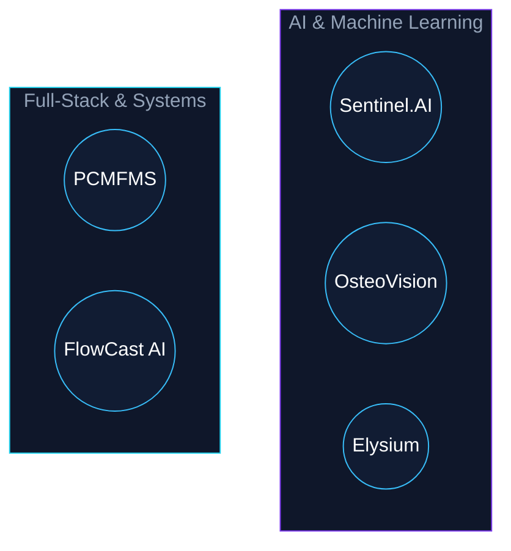
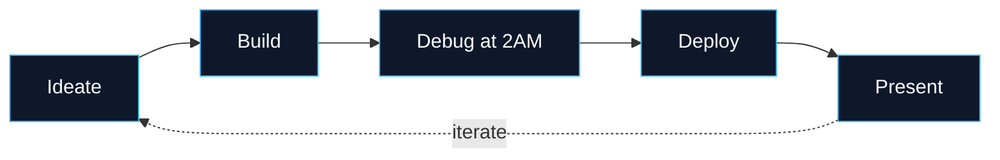

<div align="center">


<a href="https://github.com/AryanMedigeri08">
  
</a>


</div>

<br/>

```bash
$ whoami
> Aryan Medigeri — B.Tech CS (Data Science), MIT Academy of Engineering, '28
> Based in Pune, India

$ ps --status
> Shipping into Private Repos
> Open to contribute
> Currently deep in ML inference pipelines + RAG systems

$ cat achievements.log | head -3
> [1st PLACE]  National Datathon 2026 — Sentinel AI (UPI fraud detection)
> [UNDER REVIEW]  OsteoVision — peer-reviewed paper, MITAOE 2026

$ echo $MOTTO
> "Ship it, then perfect it."
```

<br/>

## Projects

<sub>clustered by focus area — click any node or name to open the repo</sub>



### AI & Machine Learning

**[Sentinel.AI](https://github.com/AryanMedigeri08/Sentinel.AI)** &nbsp;`DEPLOYED`&nbsp; · 1st place, National Datathon 2026
6-layer real-time UPI fraud detection engine
`XGBoost` `LSTM` `Isolation Forest` `Neo4j` `Kafka`

**[Elysium](https://github.com/AryanMedigeri08/Elysium)** &nbsp;`DEPLOYED — Cloud Run`
Real-time financial risk intelligence assistant, RAG over BigQuery Vector Search
`NVIDIA RAPIDS/cuDF` `Gemini Router` `GCP`

**[OsteoVision](https://github.com/AryanMedigeri08/OsteoVision)** &nbsp;`PUBLISHED`
Knee osteoarthritis severity detection — 0.92 mean IoU / 0.94 Dice
`Xception CNN` `Grad-CAM` `OpenCV` `React`

### Full-Stack & Systems

**[PCMFMS](https://github.com/AryanMedigeri08/Predictive-Cognitive-Motor-Fatigue-Monitoring-System-Using-Facial-Landmark-Stability)** &nbsp;`OPERATIONAL`
Real-time cognitive-motor fatigue monitor, server-offloaded to survive an ARM64 wall
`MediaPipe` `ONNX Runtime` `ESP32` `WebSockets`

**[FlowCast AI](https://github.com/AryanMedigeri08/flowcast-ai-design)** &nbsp;`FINALIST`&nbsp; · WSI AI-THON 2025
Supply-chain intelligence dashboard for retail demand forecasting
`React` `Recharts` `Python`

<br/>

## How I Ship Things



<br/>

## Tech Stack

**Languages**


**Frontend**


**Backend & ML**


**Data & Cloud**


<br/>

## GitHub Analytics

<div align="center">


</div>

<br/>

## Let's Connect

<div align="center">

[](mailto:work.aryan22medigeri@gmail.com)
[](https://www.linkedin.com/in/aryan-medigeri)
[](https://medium.com/@aryan22medigeri)
[](https://github.com/AryanMedigeri08)

</div>


